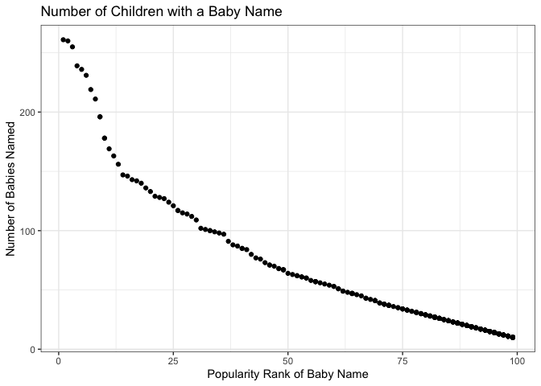

P8105: Homework 2
================
Molly Martorella
9/30/2019

# Problem 1:

## Mr. Trash Wheel

Load in Mr. Trash Wheel data and clean:

``` r
mtw <- read_excel("Trash-Wheel-Collection-Totals-8-6-19.xlsx", 
                  sheet = "Mr. Trash Wheel", 
                  range = "A2:N338") %>% 
  drop_na() %>% 
  janitor::clean_names() %>% 
  mutate(sports_balls = as.integer(round(sports_balls)),
         weight_tons = as.numeric(weight_tons))
```

## 2017 and 2018 Rain

Load Precip 2017 and 2018 data and clean:

``` r
#2018 data:

rain_2018 <- read_excel("HealthyHarborWaterWheelTotals2018-7-28.xlsx",
                   sheet = "2018 Precipitation",
                   range = "A2:B15") %>% 
  drop_na()

rain_2018 <- rain_2018 %>% 
  mutate("Year" = rep("2018", 
                      n = nrow(rain_2018))) %>% 
  select(Year, Month, Total)

#2017 data:

rain_2017 <- read_excel("HealthyHarborWaterWheelTotals2018-7-28.xlsx",
                   sheet = "2017 Precipitation",
                   range = "A2:B15") %>% 
  drop_na()

rain_2017 <- rain_2017 %>% 
  mutate("Year" = rep("2017", 
                      n = nrow(rain_2018))) %>% 
  select(Year, Month, Total)

#combined data:

rain <- rbind(rain_2017, rain_2018) %>% 
  mutate(Month = month.name[Month])

#for year based weight summary:

wt_2017 <- mtw %>% 
  filter(year == 2017)

wt_2018 <- mtw %>% 
  filter(year == 2018)
```

## Data Summary

The **mtw** dataset has *286* observations of *14* variables. Generally,
these variables specify the month and year, amount and types of trash
collected, and the number of homes powered as a result of the trash
collected. The **rain** dataset provides monthly rain totals from
Jan-Dec 2017 and Jan-July 2018, and it has *19* observations of *3*
variables.

The median number of sports balls collected in the year 2017 was *8*.

The amount of trash collected is known to be a function of the amount of
rainfall. The average precipitation from Jan-Dec 2017 was *2.7441667*,
and from Jan-July 2018 it was *3.3571429*. The average amount of trash
collected from Jan-Nov 2017 was *3.1789091* tons, and from Jan-Aug 2018
was *3.3641538* tons. This data suggests that the increased average
rainfall in 2018 also led to an increase in the amount of trash
collected compared to 2017.

# Problem 2:

Load and clean pols-month data:

``` r
pols <- read_csv(file = "fivethirtyeight_datasets/pols-month.csv") %>% 
  separate(col = mon, 
           into = c("year", "month", "day"), 
           sep = "-") %>% 
  mutate(month = as.integer(month), 
         month = month.name[month],
         year = as.numeric(year),
         day = NULL,
         prez_gop = recode(prez_gop, `0` = "dem", `1` = "gop"),
         prez_dem = NULL) %>% 
  pivot_longer(cols = prez_gop, 
               names_to = "delete", 
               values_to = "president") %>%
  mutate(delete = NULL)
```

    ## Parsed with column specification:
    ## cols(
    ##   mon = col_date(format = ""),
    ##   prez_gop = col_double(),
    ##   gov_gop = col_double(),
    ##   sen_gop = col_double(),
    ##   rep_gop = col_double(),
    ##   prez_dem = col_double(),
    ##   gov_dem = col_double(),
    ##   sen_dem = col_double(),
    ##   rep_dem = col_double()
    ## )

    ## Warning: Unreplaced values treated as NA as .x is not compatible. Please
    ## specify replacements exhaustively or supply .default

Load and clean snp data:

``` r
snp <- read_csv(file = "fivethirtyeight_datasets/snp.csv") %>%
  separate(col = date, 
           into = c("month", "day", "year"), 
           sep = "/") %>% 
  mutate(day = NULL,
         month = as.integer(month),
         month = month.name[month],
         year = as.numeric(year)) %>% 
  select("year", "month", everything())
```

    ## Parsed with column specification:
    ## cols(
    ##   date = col_character(),
    ##   close = col_double()
    ## )

Load and clean unemployment data:

``` r
jobs <- read_csv(file = "fivethirtyeight_datasets/unemployment.csv") %>%
  pivot_longer(cols = 2:13,
               names_to = "month",
               values_to = "p_unemployed") %>% 
  rename(year = Year) %>% 
  mutate(month = match(month, month.abb),
         month = month.name[month])
```

    ## Parsed with column specification:
    ## cols(
    ##   Year = col_double(),
    ##   Jan = col_double(),
    ##   Feb = col_double(),
    ##   Mar = col_double(),
    ##   Apr = col_double(),
    ##   May = col_double(),
    ##   Jun = col_double(),
    ##   Jul = col_double(),
    ##   Aug = col_double(),
    ##   Sep = col_double(),
    ##   Oct = col_double(),
    ##   Nov = col_double(),
    ##   Dec = col_double()
    ## )

Combine data:

``` r
all <- left_join(pols, snp, by = c("year", "month"))

all <- left_join(all, jobs, by = c("year", "month"))
```

The **pols** dataset contains the number of elected officials
representing the republican and democratic parties from the year 1947 to
2015, broken down by month. It has a total of 822 observations of 9
variables. The variable *president* denotes whether the president was
republican (*gop*) or democrat (*dem*) for every month and year.

The **snp** dataset has 787 observations of Standard & Poor’s stock
market index (S\&P) along with the year and month the index was
observed. There are a total of 3 variables, and the stock market index
is reported in the variable *close*. It presents data from the year 1950
to 2015.

The **jobs** dataset reports the percent unemployment from 1948 to 2015.
It has a total of 816 observations of 3 variables. Percent unemployment
is provided under the variable *p\_unemployed*.

The **all** table merges these datasets together based on month and
year. It has 822 observations of 9 variables. Importantly, these data
were combined such that all observations from each dataset were kept.
The **pols** data set has the largest range of dates, and since
observations for **snp** and **jobs** were not collected until later
years, earlier years in the **all** data set will contain NA values for
observations in those years. The key variables are the same as those
mentioned in the individual datasets (*president*, *close*,
*p\_unemployed*)

# Problem 3:

Load in baby data:

``` r
babies <- read_csv(file = "Popular_Baby_Names.csv") %>% 
  janitor::clean_names() %>% 
  mutate(gender = str_to_lower(gender),
         ethnicity = str_to_lower(ethnicity),
         childs_first_name = str_to_lower(childs_first_name),
         ethnicity = recode(ethnicity, 
                            "asian and paci" = "asian and pacific islander", 
                            "black non hisp" = "black non hispanic", 
                            "white non hisp" = "white non hispanic")) %>% 
  rename(sex = gender) %>% 
  distinct()
```

    ## Parsed with column specification:
    ## cols(
    ##   `Year of Birth` = col_double(),
    ##   Gender = col_character(),
    ##   Ethnicity = col_character(),
    ##   `Child's First Name` = col_character(),
    ##   Count = col_double(),
    ##   Rank = col_double()
    ## )

Preparing table of Olivia popularity:

``` r
olivia <- babies %>% 
  filter(childs_first_name == "olivia") %>% 
  arrange(year_of_birth) %>% 
  pivot_wider(id_cols = c(ethnicity, childs_first_name), 
              names_from = year_of_birth, 
              values_from = rank)
```

Preparing table of male name popularity:

``` r
male <- babies %>% 
  filter(sex == "male") %>% 
  arrange(year_of_birth) %>%
  pivot_wider(id_cols = c(ethnicity, childs_first_name), 
              names_from = year_of_birth, 
              values_from = rank)
```

Filter male names data and plot:

``` r
mw_2016 <- babies %>% 
  filter(sex == "male",
         year_of_birth == 2016,
         ethnicity == "white non hispanic") %>% 
  arrange(year_of_birth)

mw_2016 %>% ggplot(aes(x = rank, y = count)) +
  geom_point() +
  ggtitle("Number of Children with a Baby Name") +
  xlab("Popularity Rank of Baby Name") +
  ylab("Number of Babies Named") +
  theme_bw()
```

<!-- -->
